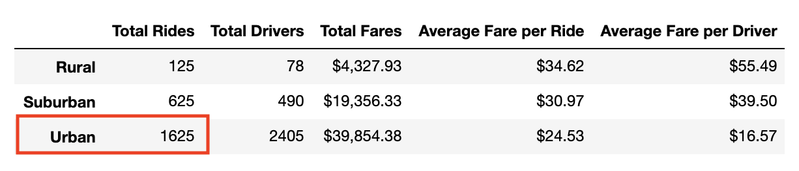
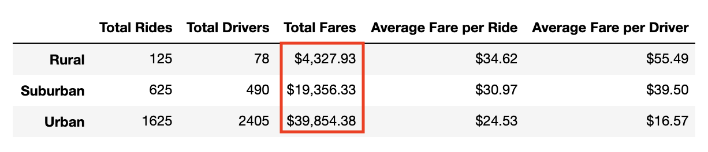
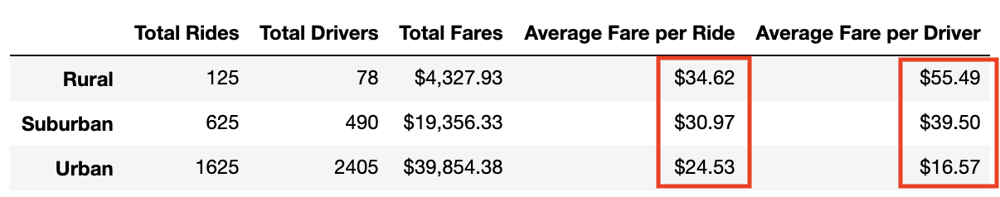
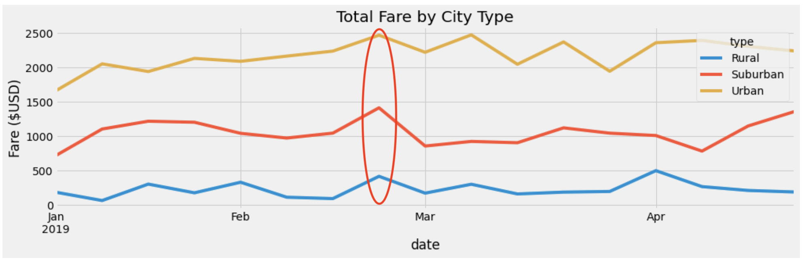

# PyBer Analysis Challenge

## Overview of the analysis
The purpose of this analysis is to show total weekly fares for each city type using a multiple line graph. This analysis can be utilized by decision makers at PyBer.

## Results
### Total Rides by City Type
Looking at the following PyBer summary dataframe, we can see that the highest number of rides are coming from the urban area, whereas, rural area has the least number of rides. Total rides coming from the suburban area are less than half of the rides in urban area.

### Total Drivers by City Type
PyBer summary shows us that the highest number of drivers are in the urban area which is natural as we see that the most rides are requested in the urban area as well. 

### Total Fares by City Type
We can observe that total fares generated from the urban areas are the highest and almost the double of suburban area. Total fares generated from the rural area are the lowest owing to the least number of rides as shown below:

### Average Fare per Ride and Driver
Average fare per ride and per driver is the cheapest for urban area since there are more number of drivers available. Average fare per ride and per driver is higher in suburban area. Similarly, average fare per ride and per driver is highest in the rural area since the number of drivers is the lowest as shown below in PyBer summary:

## Summary
Based on the data shown in the PyBer summary and Fare vs Date plot we can come up with the following recommendations:

- The fares from rural area are pretty consistent throughout the year but the number of rides are not that much. This means that the demand of rides is less in rural area. There could be more potential in rural area if the pricing model can be revised.
- If we look at the Fare vs Date plot for each city type, it is observed that the fares are peaking towards the end of Feb in all three city types. This means that the demand is higher during that time. The average fare per driver can be reduced in suburban and rural areas to see if more number of drivers become available during that time which in turn will give more room to the number of rides and ultimately will increase the total fare. 

- The company can look into starting PyBer Eats as a food order and delivery platform which will open other avenues of generating business specially in the urban area.

